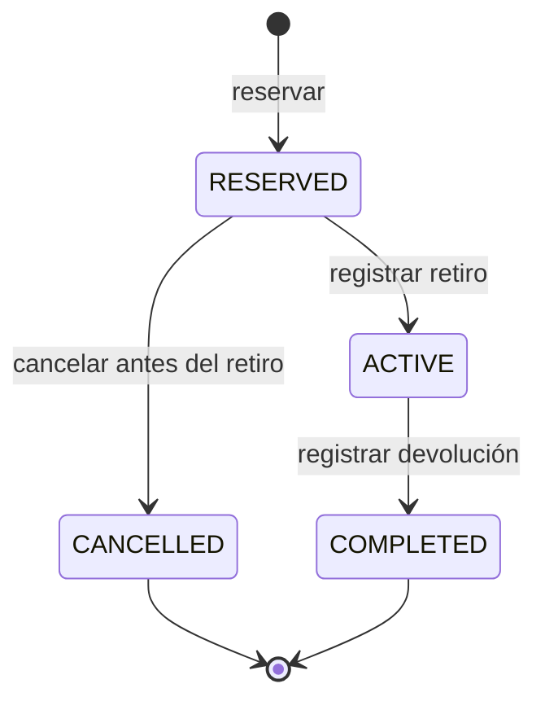

# Especificación de alcance y requisitos

| Campo | Valor |
| --- | --- |
| Proyecto | Car Cruds |
| Versión documental | 0.2 |
| Fecha | 10 de octubre de 2026 |
| Estado | Diseño propuesto; preparación documental de la entrega 2 |
| Hito | Entrega 2: 23 de octubre de 2026 |

Este documento establece el alcance funcional y las reglas del sistema de alquiler de vehículos. La revisión incorpora el feedback docente comunicado por el grupo: Load Balancer, microservicio de Empleados y definición de épicas, historias, requerimientos y patrones antes de programar. La documentación prepara la entrega 2; no acredita su implementación.

## 1. Problema y objetivo

Una concesionaria administra una flota para alquiler. Necesita asignar autos a clientes, preservar el precio acordado y controlar reserva, retiro y devolución. Dos clientes no pueden reservar el mismo auto durante períodos superpuestos. Un auto aún no devuelto tampoco puede entregarse a otro cliente.

La empresa también necesita gestionar su personal: intercambiar con el gimnasio el listado de empleados y la información de uso de membresías, y solicitar revisiones de posibles incorporaciones mediante los turnos de una clínica. Los informes administrativos deben mostrar qué datos están confirmados y cuáles faltan. Esta ampliación no cambia las reglas de reserva ni la autoridad de Alquileres.

## 2. Actores

| Actor | Objetivo |
| --- | --- |
| Cliente | Buscar, cotizar, reservar, consultar y cancelar su reserva |
| Operador | Administrar catálogo/clientes, registrar retiro y devolución, bloquear períodos por mantenimiento |
| Responsable de personal | Gestionar candidatos y empleados; solicitar revisiones y consultar informes de turnos y membresías |
| Gimnasio, sistema consumidor | Consumir la lista de empleados y comunicar el uso o no uso de membresías |
| Clínica, sistema proveedor | Ofrecer la capacidad de turnos para revisiones previas a una incorporación |

La identidad del gimnasio identifica una aplicación con un permiso acotado. Un empleado no es un cliente conductor; un candidato tampoco se considera automáticamente contratado. Los identificadores de vinculación externa, permisos, población compartida y protocolos se acordarán según [el registro de integraciones](docs/INTEGRACIONES.md).

## 3. Alcance funcional

- Catálogo de vehículos con características y tarifa diaria vigente.
- Búsqueda indexada, paginación, filtros por marca/categoría/transmisión/plazas y orden por tarifa.
- Registro de clientes y habilitación del conductor según reglas del proyecto.
- Consulta de disponibilidad y cálculo del precio para fechas seleccionadas.
- Reserva, cancelación previa al retiro, retiro y devolución.
- Bloqueos de agenda por mantenimiento; historial de reservas y alquileres.
- Gestión administrativa de candidatos y empleados en un cuarto microservicio de negocio.
- Lista de empleados publicada al gimnasio, recepción de información de uso y un informe de membresías por período.
- Consumo del servicio de turnos de la clínica e informe de personas con turno confirmado, sin turno confirmado y con información pendiente de verificar.
- Capacidad compartida centrada en Empleados; el contrato y el mock de reservas de la entrega 1 se conservan como evidencia histórica.
- Frontend web, gateway, persistencia por servicio, comunicación HTTP y mensajería.
- Load Balancer explícito para distribuir solicitudes entre dos réplicas de Flota, conforme al diseño de D12.
- Consistencia de reservas, resiliencia, caché medida, observabilidad, pruebas y ejecución automatizada.

El diseño contempla el registro manual del cobro como parte del alquiler. Quedan fuera del alcance inicial la pasarela de pagos reales, la facturación fiscal, la venta de vehículos, la operación de múltiples sucursales, los seguros externos y el cálculo de multas, daños y combustible. Las ampliaciones se incorporarán mediante una revisión del alcance y de las decisiones afectadas.

La gestión de personal no incluye nómina, diagnóstico médico, determinación de aptitud, contratación automática, facturación del gimnasio ni cancelación automática de membresías. No se calcularán gastos monetarios sin tarifas, período y regla de imputación acordados; el primer informe de membresías aporta evidencia de uso para apoyar decisiones administrativas.

## 4. Convenciones del dominio

1. Una sucursal opera en `America/Buenos_Aires` y los alquileres se planifican por días calendario completos.
2. El período es `[startsOn, endsOn)`: incluye el día inicial y excluye el final. Del 15 al 18 son tres días. Dos períodos que terminan y comienzan el mismo día no se superponen en la agenda.
3. La duración válida es de 1 a 30 días. El sistema real rechazará un inicio anterior a la fecha actual de la sucursal. El mock omite la restricción de fecha actual para que los ejemplos sean reproducibles.
4. Moneda inicial: ARS. Los importes se expresan en centavos enteros (`*Minor`); no se utiliza coma flotante para dinero.
5. Precio base = días × tarifa diaria. La tarifa y el total se congelan al reservar. Un cambio de tarifa posterior no modifica una reserva ya creada.
6. Consultar disponibilidad no garantiza una reserva. Al confirmar se vuelve a comprobar el período y el importe esperado.

Estas convenciones corresponden al diseño preliminar del proyecto y se utilizarán como referencia para la implementación y sus pruebas.

## 5. Reglas de negocio y criterios de aceptación

| Identificador | Regla | Criterio de aceptación |
| --- | --- | --- |
| RN-01 | Período válido | Inicio anterior al fin, fechas válidas y duración entre 1 y 30 días; datos inválidos se rechazan sin reservar |
| RN-02 | Cliente habilitado | La reserva requiere un cliente existente, activo y con licencia registrada vigente durante el período; si está bloqueado, se rechaza |
| RN-03 | Exclusión de períodos | Para un auto, dos reservas que ocupan agenda no pueden satisfacer `inicioA < finB` y `inicioB < finA` simultáneamente |
| RN-04 | Concurrencia | Frente a dos solicitudes válidas que compiten simultáneamente por un período libre del mismo auto, se confirma una sola reserva y la otra recibe conflicto |
| RN-05 | Idempotencia | Misma aplicación, clave y solicitud devuelve la respuesta original; una carga distinta con la misma clave se rechaza |
| RN-06 | Precio acordado | Si el importe esperado coincide con el cálculo autorizado, se guarda el precio; de lo contrario se pide una nueva cotización |
| RN-07 | Cancelación | Solo una reserva sin retiro puede cancelarse; cancelar otra vez devuelve el estado cancelado y libera la agenda una sola vez |
| RN-08 | Retiro exclusivo | Solo puede retirarse una reserva vigente si el conductor sigue habilitado y no hay otro alquiler activo para el auto |
| RN-09 | Devolución | Solo un alquiler activo puede finalizarse; repetir la operación no registra una segunda devolución |
| RN-10 | Devolución tardía | Llegar al fin previsto no finaliza el alquiler automáticamente; el operador recibe un conflicto de entrega mientras siga activo |
| RN-11 | Mantenimiento | Registrar un bloqueo de agenda se valida en Alquileres contra reservas y otros bloqueos; no se confirma silenciosamente sobre una reserva existente |
| RN-12 | Propiedad y permisos | Cliente consulta/modifica solo sus reservas; operador administra las permitidas; consumidor accede solo al ámbito asignado |
| RN-13 | Candidato y empleado | Registrar un candidato no lo incorpora a la lista de empleados del gimnasio; la vinculación y el alta laboral requieren una acción administrativa autorizada |
| RN-14 | Datos mínimos para el gimnasio | La lista expone únicamente los campos administrativos acordados y autorizados; excluye datos de clientes, credenciales y datos médicos |
| RN-15 | Uso de membresías | El informe distingue uso informado, no uso informado e información faltante para el período; ausencia de respuesta no se registra como no uso |
| RN-16 | Evidencia de gastos | Se muestran uso, período y origen de la información; no se inventan tarifas ni se infieren montos sin un acuerdo de cálculo |
| RN-17 | Solicitud y turno | Solicitar una revisión no confirma por sí solo un turno ni acredita asistencia; solo una respuesta o conciliación válida puede confirmar el turno |
| RN-18 | Ausencia e incertidumbre | Un resultado desconocido, un timeout o una respuesta inválida no prueban que una persona no tenga turno; el informe conserva esa distinción |
| RN-19 | Repetición y orden | Repetir la misma comunicación no duplica efectos; la regla para mensajes atrasados y modificaciones se acordará y probará antes de integrar |
| RN-20 | Aislamiento de funcionalidades | Una falla del gimnasio o la clínica afecta el flujo de personal correspondiente y no bloquea una reserva de vehículos ni cambia su agenda |

La cobertura ejecutable actual continúa limitada al mock de consulta de disponibilidad, validación de período e importe, reserva, idempotencia y cancelación. La habilitación del cliente se representa mediante datos de demostración. RN-13 a RN-20 son propuestas para la ampliación y no tienen implementación todavía. Las pruebas y criterios por funcionalidad se definen en [las historias de usuario](docs/BACKLOG.md) y [los requerimientos](docs/REQUERIMIENTOS.md).

## 6. Ciclo de vida de la reserva

**Figura 1.** Transiciones del ciclo de vida de la reserva y el alquiler.

| Estado | Significado |
| --- | --- |
| `RESERVED` | Reserva confirmada, pendiente de retiro |
| `ACTIVE` | Vehículo retirado; alquiler en curso |
| `COMPLETED` | Devolución registrada; alquiler finalizado |
| `CANCELLED` | Reserva cancelada antes del retiro |

`RESERVED` y `ACTIVE` conservan la asignación planificada. `ACTIVE` también impide cualquier otro retiro del mismo auto, aunque haya vencido su fin previsto. El atraso se determina a partir de la fecha prevista y la ausencia de devolución; no genera una transición automática a `COMPLETED`.

## 7. Planificación por hitos

| Identificador | Funcionalidad | Hito |
| --- | --- | --- |
| F-01 | Definir dominio, alcance y arquitectura | Entrega 1 |
| F-02 | Contrato y mock de disponibilidad/reservas conservados como evidencia | Entrega 1 |
| F-03 | Implementar flujo de alquiler propio con persistencia y sus dependencias necesarias | Entrega 2, pendiente |
| F-04 | Implementar Empleados y la capacidad de lista operativa para el gimnasio; acordar contratos y registrar las decisiones del hito | Entrega 2, pendiente |
| F-05 | Completar frontend, cuatro servicios, retiro/devolución e integraciones de personal reales | Presentación grupal, pendiente |
| F-06 | Demostrar concurrencia, carga, balanceo, fallas y observabilidad | Defensa individual, con ensayos previos |

La entrega 2 requiere al menos un servicio operativo además de la funcionalidad compartida funcionando, almacenamiento real, logs correlacionados y una primera traza distribuida. Incluye D2, D6, D7, D9, D10, D12 y D13, validación de D1/D3/D5 y primera versión de D11, además de actualizar D8 por el cambio de capacidad. El [control de entrega 2](docs/ENTREGA-2.md) identifica qué está diseñado y qué sigue pendiente de implementación y evidencia.

## 8. Integración entre grupos

**Capacidad ofrecida al gimnasio:** lista de empleados de la empresa. El gimnasio comunica cuáles utilizan la membresía y cuáles no. Empleados vincula esos datos y el responsable de personal obtiene un informe de uso para controlar beneficios y apoyar el análisis de gastos. La población, los campos, el período, la devolución de información y las condiciones de uso requieren acuerdo. El borrador de la API propia se identifica como propuesta en [la documentación de contratos](docs/contracts/README.md).

**Capacidad consumida de la clínica:** turnos para revisiones de personas que la empresa quiere contratar. Empleados conserva la intención local, solicita o gestiona el turno conforme al contrato externo y concilia su estado para producir un informe administrativo. Está pendiente conocer si Car Cruds confirma una reserva directamente o la persona debe completar pasos externos. La llamada sale de Empleados; el frontend y el gateway propio no realizan la llamada al proveedor.

Los acuerdos, los estados de información y los escenarios de falla se detallan en [docs/INTEGRACIONES.md](docs/INTEGRACIONES.md). La API de reservas de la entrega 1 continúa disponible solo en su mock local; no constituye la integración actual acordada con el gimnasio.

## 9. Referencia histórica de la primera entrega

| Identificador | Resultado esperado |
| --- | --- |
| CE-01 | Alcance y arquitectura documentados, con diagramas de contexto y contenedores |
| CE-02 | Responsabilidades, datos propios y dependencias de los tres servicios identificados |
| CE-03 | D1 y D8 registrados; D3 y D5 disponibles en versión inicial |
| CE-04 | Contrato versionado con operaciones, entradas, respuestas, errores y condiciones de uso |
| CE-05 | Mock ejecutable con consulta, reserva, consulta de estado y cancelación |
| CE-06 | Pruebas de concurrencia e idempotencia que detecten asignaciones duplicadas |
| CE-07 | Instrucciones suficientes para ejecutar y demostrar el contrato localmente |

Estos criterios describen el alcance original de la entrega 1, de tres servicios y capacidad de reservas. La evidencia se conserva en [docs/ENTREGA-1.md](docs/ENTREGA-1.md). El diseño actual añade Empleados, incorpora el balanceador y cambia la capacidad entre grupos; su aceptación y avance se registran por separado en la entrega 2.

## 10. Aspectos por resolver

- Integrantes y responsables de los componentes; confirmación docente de la ampliación y su relevancia como integración de negocio.
- Tecnologías y versiones definitivas; llevar a código y verificar los patrones documentados en D2.
- Aceptación de las reglas propuestas: días completos, tope de 30 días, moneda y cancelación.
- Condiciones operativas de retiro/devolución y coordinación de cambios administrativos.
- Contratos formales de gimnasio y clínica, identificadores, población compartida, semántica de estados y períodos, credenciales y entornos accesibles: [pendientes de integración](docs/INTEGRACIONES.md).

## 11. Glosario

| Término | Definición |
| --- | --- |
| Flota | Conjunto de vehículos que la concesionaria administra para alquiler |
| Reserva | Asignación de un auto a un cliente para un período, pendiente de retiro |
| Alquiler activo | Operación iniciada con el retiro del auto y pendiente de devolución |
| Idempotencia | Propiedad que permite repetir una solicitud identificada sin duplicar su efecto |
| Mock | Simulación ejecutable del contrato mediante datos de demostración |
| Candidato | Persona considerada para una incorporación; no es automáticamente un empleado |
| Empleado | Persona con una relación laboral registrada por la empresa |
| Uso informado | Evidencia comunicada por el gimnasio para un período y una persona identificados |
| Turno confirmado | Turno cuya existencia se verificó mediante una respuesta válida del proveedor |
| Estado desconocido | Información insuficiente para afirmar un resultado positivo o negativo |

## 12. Organización de la especificación

- [Épicas e historias](docs/BACKLOG.md): valor de negocio, criterios Dado/Cuando/Entonces, prioridades y dependencias.
- [Requerimientos](docs/REQUERIMIENTOS.md): RF/RNF, trazabilidad a reglas e historias y validación prevista.
- [Arquitectura](docs/ARCHITECTURE.md) y [ADR](docs/adr/README.md): responsabilidades, estilos internos, patrones y consecuencias.
- [Integraciones](docs/INTEGRACIONES.md): alcance confirmado, propuestas internas y acuerdos externos pendientes.
- [Entrega 2](docs/ENTREGA-2.md): relación con el enunciado, secuencia de trabajo y evidencia faltante.
