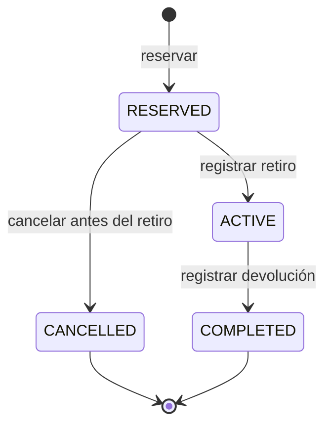

# Especificación de alcance y requisitos

| Campo | Valor |
| --- | --- |
| Proyecto | Car Cruds |
| Versión documental | 0.1 |
| Fecha | 7 de octubre de 2026 |
| Estado | Diseño preliminar |
| Hito | Entrega 1: 9 de octubre de 2026 |

Este documento establece el alcance funcional, las reglas de negocio y los criterios de aceptación del sistema de alquiler de vehículos. Las decisiones de esta versión constituyen la base de diseño para los siguientes hitos.

## 1. Problema y objetivo

Una concesionaria administra una flota para alquiler. Necesita asignar autos a clientes, preservar el precio acordado y controlar reserva, retiro y devolución. Dos clientes no pueden reservar el mismo auto durante períodos superpuestos. Un auto aún no devuelto tampoco puede entregarse a otro cliente.

## 2. Actores

| Actor | Objetivo |
| --- | --- |
| Cliente | Buscar, cotizar, reservar, consultar y cancelar su reserva |
| Operador | Administrar catálogo/clientes, registrar retiro y devolución, bloquear períodos por mantenimiento |
| Grupo consumidor | Consultar disponibilidad y crear/cancelar una reserva mediante la capacidad publicada |
| Proveedor externo asignado por la cátedra | Aportar una capacidad que se incorporará al flujo principal |

La autenticación del grupo consumidor identifica una aplicación. El identificador de cliente referencia a un cliente previamente registrado; no habilita la creación de perfiles por la API compartida. El mecanismo de alta o vinculación con consumidores externos se acordará antes de la integración real.

## 3. Alcance funcional

- Catálogo de vehículos con características y tarifa diaria vigente.
- Búsqueda indexada, paginación, filtros por marca/categoría/transmisión/plazas y orden por tarifa.
- Registro de clientes y habilitación del conductor según reglas del proyecto.
- Consulta de disponibilidad y cálculo del precio para fechas seleccionadas.
- Reserva, cancelación previa al retiro, retiro y devolución.
- Bloqueos de agenda por mantenimiento; historial de reservas y alquileres.
- API compartida de disponibilidad y reservas, y consumo de la capacidad externa asignada.
- Frontend web, gateway, persistencia por servicio, comunicación HTTP y mensajería.
- Consistencia de reservas, resiliencia, caché medida, observabilidad, pruebas y ejecución automatizada.

El diseño contempla el registro manual del cobro como parte del alquiler. Quedan fuera del alcance inicial la pasarela de pagos reales, la facturación fiscal, la venta de vehículos, la operación de múltiples sucursales, los seguros externos y el cálculo de multas, daños y combustible. Las ampliaciones se incorporarán mediante una revisión del alcance y de las decisiones afectadas.

## 4. Convenciones del dominio

1. Una sucursal opera en `America/Buenos_Aires` y los alquileres se planifican por días calendario completos.
2. El período es `[startsOn, endsOn)`: incluye el día inicial y excluye el final. Del 15 al 18 son tres días. Dos períodos que terminan y comienzan el mismo día no se superponen en la agenda.
3. La duración válida es de 1 a 30 días. El sistema real rechazará un inicio anterior a la fecha actual de la sucursal. El mock omite la restricción de fecha actual para que los ejemplos sean reproducibles.
4. Moneda inicial: ARS. Los importes se expresan en centavos enteros (`*Minor`); no se utiliza coma flotante para dinero.
5. Precio base = días × tarifa diaria. La tarifa y el total se congelan al reservar. Un cambio de tarifa posterior no modifica una reserva ya creada.
6. Consultar disponibilidad no garantiza una reserva. Al confirmar se vuelve a comprobar el período y el importe esperado.

Estas convenciones corresponden al diseño preliminar del proyecto y se utilizarán como referencia para la implementación y sus pruebas.

## 5. Reglas de negocio y criterios de aceptación

| Identificador | Regla | Criterio de aceptación |
| --- | --- | --- |
| RN-01 | Período válido | Inicio anterior al fin, fechas válidas y duración entre 1 y 30 días; datos inválidos se rechazan sin reservar |
| RN-02 | Cliente habilitado | La reserva requiere un cliente existente, activo y con licencia registrada vigente durante el período; si está bloqueado, se rechaza |
| RN-03 | Exclusión de períodos | Para un auto, dos reservas que ocupan agenda no pueden satisfacer `inicioA < finB` y `inicioB < finA` simultáneamente |
| RN-04 | Concurrencia | Frente a dos solicitudes válidas que compiten simultáneamente por un período libre del mismo auto, se confirma una sola reserva y la otra recibe conflicto |
| RN-05 | Idempotencia | Misma aplicación, clave y solicitud devuelve la respuesta original; una carga distinta con la misma clave se rechaza |
| RN-06 | Precio acordado | Si el importe esperado coincide con el cálculo autorizado, se guarda el precio; de lo contrario se pide una nueva cotización |
| RN-07 | Cancelación | Solo una reserva sin retiro puede cancelarse; cancelar otra vez devuelve el estado cancelado y libera la agenda una sola vez |
| RN-08 | Retiro exclusivo | Solo puede retirarse una reserva vigente si el conductor sigue habilitado y no hay otro alquiler activo para el auto |
| RN-09 | Devolución | Solo un alquiler activo puede finalizarse; repetir la operación no registra una segunda devolución |
| RN-10 | Devolución tardía | Llegar al fin previsto no finaliza el alquiler automáticamente; el operador recibe un conflicto de entrega mientras siga activo |
| RN-11 | Mantenimiento | Registrar un bloqueo de agenda se valida en Alquileres contra reservas y otros bloqueos; no se confirma silenciosamente sobre una reserva existente |
| RN-12 | Propiedad y permisos | Cliente consulta/modifica solo sus reservas; operador administra las permitidas; consumidor accede solo al ámbito asignado |

La cobertura de esta entrega comprende consulta de disponibilidad, validación de período e importe, reserva, idempotencia y cancelación. La habilitación del cliente se representa mediante datos de demostración. Las verificaciones de licencia, los permisos individuales, el retiro, la devolución y los bloqueos de mantenimiento se implementarán en los servicios de negocio.

## 6. Ciclo de vida de la reserva

**Figura 1.** Transiciones del ciclo de vida de la reserva y el alquiler.

| Estado | Significado |
| --- | --- |
| `RESERVED` | Reserva confirmada, pendiente de retiro |
| `ACTIVE` | Vehículo retirado; alquiler en curso |
| `COMPLETED` | Devolución registrada; alquiler finalizado |
| `CANCELLED` | Reserva cancelada antes del retiro |

`RESERVED` y `ACTIVE` conservan la asignación planificada. `ACTIVE` también impide cualquier otro retiro del mismo auto, aunque haya vencido su fin previsto. El atraso se determina a partir de la fecha prevista y la ausencia de devolución; no genera una transición automática a `COMPLETED`.

## 7. Planificación por hitos

| Identificador | Funcionalidad | Hito |
| --- | --- | --- |
| F-01 | Definir dominio, alcance y arquitectura | Entrega 1 |
| F-02 | Publicar contrato y mock de disponibilidad/reservas | Entrega 1 |
| F-03 | Implementar flujo real de disponibilidad y reserva con persistencia | Entrega 2 |
| F-04 | Preparar búsqueda, caché e integración con proveedor según decisiones de ese hito | Entrega 2 |
| F-05 | Completar frontend, tres servicios, retiro/devolución y capacidad publicada real | Presentación grupal |
| F-06 | Demostrar concurrencia, carga, balanceo, fallas y observabilidad | Defensa individual, con ensayos previos |

La planificación se corresponde con el cronograma del enunciado. La entrega 2 incluye las decisiones D2, D6, D7, D9, D10, D12 y D13, la validación de D1/D3/D5 y la primera versión de D11. El detalle de la primera entrega se registra en [la matriz de entregables](docs/ENTREGA-1.md).

## 8. Integración entre grupos

**Capacidad ofrecida:** consultar disponibilidad y precio, crear una reserva, recuperar su estado y cancelarla antes del retiro. Esta capacidad permite que un sistema consumidor incorpore un vehículo reservado a una contratación de traslado o a un paquete de viaje. El contrato y sus condiciones se describen en [docs/contracts/README.md](docs/contracts/README.md).

**Capacidad consumida:** pendiente de asignación docente. Su incorporación deberá afectar un flujo de negocio, como cotización, habilitación o confirmación, según las operaciones que publique el proveedor. El servicio responsable implementará la integración y su tratamiento de errores sobre ese contrato.

## 9. Criterios de aceptación de la primera entrega

| Identificador | Resultado esperado |
| --- | --- |
| CE-01 | Alcance y arquitectura documentados, con diagramas de contexto y contenedores |
| CE-02 | Responsabilidades, datos propios y dependencias de los tres servicios identificados |
| CE-03 | D1 y D8 registrados; D3 y D5 disponibles en versión inicial |
| CE-04 | Contrato versionado con operaciones, entradas, respuestas, errores y condiciones de uso |
| CE-05 | Mock ejecutable con consulta, reserva, consulta de estado y cancelación |
| CE-06 | Pruebas de concurrencia e idempotencia que detecten asignaciones duplicadas |
| CE-07 | Instrucciones suficientes para ejecutar y demostrar el contrato localmente |

La evidencia local y su correspondencia con el enunciado se registran en [docs/ENTREGA-1.md](docs/ENTREGA-1.md). La persistencia distribuida y la integración externa pertenecen a los hitos posteriores.

## 10. Aspectos por resolver

- Integrantes y confirmación de la aprobación del dominio y alcance por los profesores.
- Tecnologías definitivas, validación de los patrones internos respecto de los contenidos de la materia y responsable de cada componente.
- Aceptación de las reglas propuestas: días completos, tope de 30 días, moneda y cancelación.
- Registro/vinculación de clientes del consumidor y condiciones operativas de retiro/devolución.
- Proveedor y consumidor asignados, credenciales reales, URL pública y acuerdo del contrato.

## 11. Glosario

| Término | Definición |
| --- | --- |
| Flota | Conjunto de vehículos que la concesionaria administra para alquiler |
| Reserva | Asignación de un auto a un cliente para un período, pendiente de retiro |
| Alquiler activo | Operación iniciada con el retiro del auto y pendiente de devolución |
| Idempotencia | Propiedad que permite repetir una solicitud identificada sin duplicar su efecto |
| Mock | Simulación ejecutable del contrato mediante datos de demostración |
