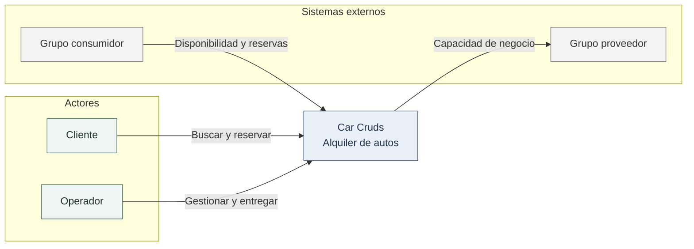
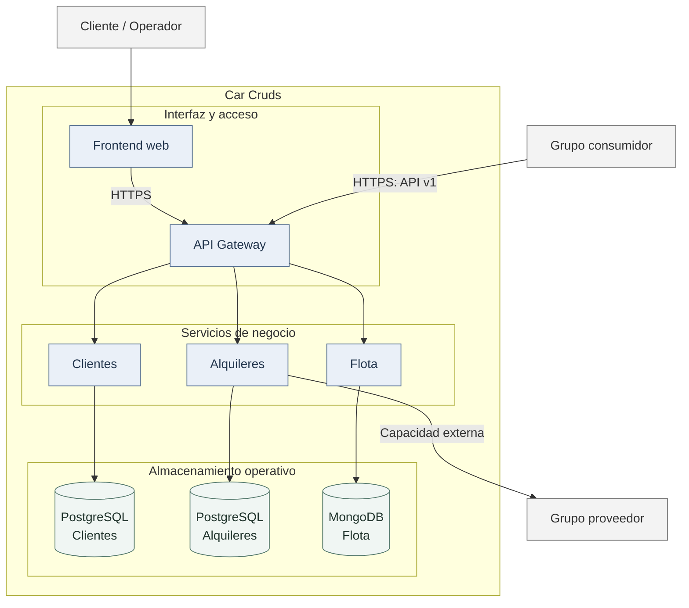
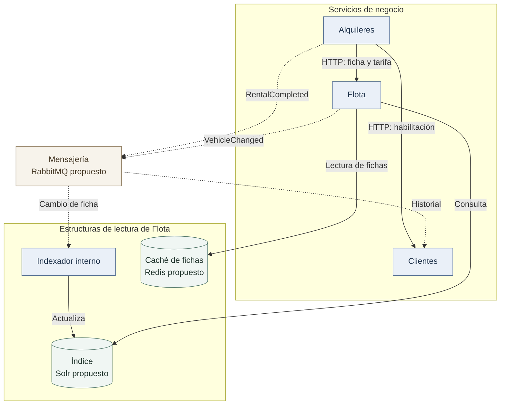

# Documento de arquitectura — Car Cruds

| Campo | Valor |
| --- | --- |
| Versión | 0.1 |
| Fecha | 7 de octubre de 2026 |
| Estado | Diseño preliminar |
| Hito | Entrega 1 — 9 de octubre de 2026 |
| Registros relacionados | D1, D3, D5 y D8 en `docs/adr/` |

## 1. Propósito y alcance

Car Cruds es un sistema de alquiler de autos por período y con tarifa. Su arquitectura permite consultar vehículos, confirmar una reserva sin asignaciones superpuestas, conservar el precio acordado y controlar el retiro y la devolución.

Este documento define los límites de los servicios, la propiedad de los datos, las comunicaciones y la distribución prevista. La operación crítica es la confirmación de una reserva: debe resolver concurrencia y reintentos sin duplicar la asignación del auto.

### Estado de implementación de la versión 0.1

| Componente | Estado |
| --- | --- |
| Contrato y mock HTTP | Contrato versionado y simulación local en memoria de disponibilidad y reservas |
| Microservicios, gateway y frontend | Estructura inicial y responsabilidades documentadas |
| Persistencia, mensajería, búsqueda y caché | Diseño preliminar; implementación prevista en hitos posteriores |
| Despliegue e integración entre grupos | Entorno y participantes por definir |

## 2. Contexto del sistema

**Figura 1. Contexto de Car Cruds.** El cliente y el operador acceden mediante la interfaz web. El grupo consumidor utiliza la capacidad publicada. La capacidad del grupo proveedor se incorporará en un flujo de negocio desde el servicio responsable. La cátedra asignará ambos grupos.

## 3. Contenedores y distribución de responsabilidades

**Figura 2. Contenedores principales.** Se distinguen el acceso público, los tres servicios de negocio y sus almacenes operativos dentro de la frontera de Car Cruds. La figura 3 detalla la comunicación interna y las estructuras de lectura.

Cada base pertenece a un servicio. Las bases de Clientes y Alquileres podrán compartir un servidor PostgreSQL en desarrollo, con bases y credenciales separadas. El acceso entre servicios se realiza mediante contratos; se evita el acceso directo a almacenes ajenos.

Solr, Redis y RabbitMQ son alternativas tecnológicas propuestas. Su selección se justificará y validará en los ADR correspondientes. La comunicación con el proveedor se origina directamente en el microservicio que utiliza su capacidad. El diagrama sitúa ese adaptador en Alquileres; su ubicación definitiva dependerá del contrato asignado.

### Propiedad de los datos

| Servicio | Responsabilidad | Datos propios | Dependencias previstas |
| --- | --- | --- | --- |
| Clientes | Perfil y habilitación del conductor; historial proyectado | Cliente, licencia y estado, eventos procesados, historial de alquileres | PostgreSQL y mensajería |
| Flota | Características, catálogo y tarifa diaria vigente; búsqueda | Vehículo, tarifa, versión de ficha, eventos de cambio | MongoDB, motor de búsqueda, caché y mensajería |
| Alquileres | Precio acordado, reserva exclusiva, agenda, retiro y devolución | Reserva, alquiler, bloqueos de mantenimiento, importes congelados, idempotencia y outbox | PostgreSQL, Clientes, Flota, mensajería y proveedor externo |

**Alquileres es la única autoridad sobre la disponibilidad temporal.** Reservas y bloqueos de mantenimiento se validan dentro de su misma frontera transaccional. Flota conserva las características del auto y su habilitación administrativa para aparecer en el catálogo; la ocupación temporal corresponde a Alquileres.

Una modificación administrativa en Flota preserva las reservas existentes. Cualquier cambio que deba impedir una entrega requiere un comando explícito y validado en Alquileres. La coordinación de la baja de un auto con reservas futuras forma parte de los aspectos por resolver.

## 4. Arquitectura interna de los servicios

| Servicio | Patrón propuesto | Aplicación y justificación |
| --- | --- | --- |
| Alquileres | Arquitectura hexagonal | Aísla reglas de precio, solapamiento y estados de los adaptadores de persistencia, HTTP y mensajería. Los casos de uso utilizan puertos para Clientes, Flota, proveedor y eventos. |
| Clientes | Arquitectura en capas | Separa presentación HTTP, lógica de habilitación y acceso a datos para un modelo centrado en perfiles y validaciones. |
| Flota | Arquitectura en capas | Organiza gestión del catálogo y acceso a datos, con adaptadores de indexación y caché para las lecturas. |

En Alquileres, el dominio permanece independiente de HTTP y de los controladores de base de datos. En los servicios en capas, los controladores invocan la lógica de aplicación, que concentra las reglas y el acceso a persistencia. La búsqueda facilita la selección de un auto; la autorización de una reserva se realiza en Alquileres.

Los patrones se formalizarán en D2 durante la entrega 2 y se contrastarán con los trabajados en la materia. La estructura inicial reserva esas responsabilidades; la elección del lenguaje y del framework permanece abierta.

## 5. Confirmación de reserva y consistencia

1. El gateway autentica y dirige la solicitud a Alquileres, conservando la identidad de aplicación o usuario y el identificador de correlación.
2. Alquileres consulta la clave de idempotencia en el ámbito de la aplicación y la operación. Un reintento válido recupera la respuesta original antes de revalidar precio y agenda.
3. Obtiene la habilitación de Clientes y la ficha y tarifa de Flota con tiempos de espera limitados. La lectura utilizada para confirmar obtiene la tarifa de la fuente autoritativa y omite la caché, incluso con un TTL vigente.
4. Compara el importe esperado con el cálculo autorizado. Una diferencia genera un conflicto de precio.
5. En una transacción local, valida la exclusión por auto y período y registra la reserva, el precio acordado, la respuesta de idempotencia y el evento en outbox. Una restricción de exclusión de rangos o un mecanismo de bloqueo apropiado protege la operación concurrente; D4 determinará la solución concreta.
6. El publicador entrega el evento persistido a mensajería. Una indisponibilidad temporal del broker deja el evento pendiente y conserva la reserva confirmada.

La consistencia crítica se concentra en la transacción de Alquileres. Las validaciones de Clientes y Flota utilizan HTTP, sin una transacción distribuida entre los tres servicios. El precio congelado corresponde a la tarifa obtenida al confirmar; los cambios posteriores preservan ese acuerdo. La habilitación y las condiciones de entrega vuelven a verificarse en el retiro.

La exclusión de períodos protege la agenda planificada. Además, un alquiler activo impide otro retiro del mismo auto, aunque haya vencido su fecha de devolución. El transcurso del plazo previsto no finaliza automáticamente un alquiler.

El mock reemplaza las dependencias por datos de prueba y la transacción por un bloqueo de memoria. Permite verificar el comportamiento del contrato en un proceso. Las garantías entre múltiples instancias y la recuperación tras reinicio requieren la implementación y validación de la persistencia real.

## 6. Lecturas, proyecciones y caché

**Figura 3. Comunicación y estructuras de lectura.** Las flechas continuas representan llamadas síncronas u operaciones sobre las estructuras de lectura; las discontinuas representan publicación y consumo de eventos. El indexador es un trabajador de Flota. La publicación utiliza outbox, según D3 y D5. La telemetría de gateway y servicios se describe en la sección 7.

### Búsqueda

Flota mantendrá un índice de características y tarifas. Las modificaciones publicarán `VehicleChanged.v1`; el indexador aplicará actualizaciones idempotentes por identificador y versión. Se establece como objetivo preliminar un retraso máximo de **5 segundos en operación normal**, medido desde el cambio en la fuente hasta su aparición en el índice. La reconstrucción utilizará los datos de Flota.

La búsqueda ofrecerá paginación, filtros y ordenamiento por tarifa. La disponibilidad por fechas se consultará a Alquileres. La actualización del índice se realizará a partir de cambios de datos, independientemente de las búsquedas de los usuarios.

### Caché

Se propone una caché de fichas consultadas con frecuencia, con TTL de 60 segundos e invalidación al modificar la ficha. Su impacto se verificará comparando latencia, accesos a almacenamiento y tasa de aciertos antes y después de incorporarla. La confirmación de una reserva utiliza la lectura autoritativa sin caché descrita en la sección 5.

Los objetivos de retraso y TTL se validarán mediante mediciones y se registrarán en D6 y D7. El índice y la caché son estructuras derivadas; las fuentes operativas conservan los datos de negocio.

## 7. Resiliencia, observabilidad y balanceo

### Comunicación y protección ante fallas

Se proponen tiempos de espera acotados, circuit breaker para dependencias HTTP y reintentos limitados ante errores transitorios de lectura. Una operación de resultado desconocido se recupera mediante la misma clave de idempotencia o mediante consulta de estado. Los mensajes fallidos tendrán reintentos limitados y una cola para mensajes no procesables. D5 especifica las políticas iniciales.

### Observabilidad

Los logs estructurados en JSON incluirán servicio, instancia, operación, duración, resultado y correlación. Las credenciales y los documentos completos del cliente se excluirán de los registros. Las trazas abarcarán el gateway y las comunicaciones entre servicios.

| Métrica prevista | Propósito |
| --- | --- |
| Latencia y errores por servicio | Detectar degradación de las operaciones |
| Conflictos de reserva | Observar el funcionamiento de la exclusión y la demanda |
| Tasa de aciertos y accesos a almacenamiento | Medir el efecto de la caché |
| Retraso del índice y eventos pendientes | Detectar acumulación en las proyecciones |
| Solicitudes y disponibilidad por instancia | Verificar balanceo y retirada de instancias caídas |

El tablero, el objetivo de servicio y las alertas se definirán en D11. La evidencia se obtendrá sobre componentes implementados mediante pruebas de carga y fallas controladas.

### Balanceo

Se propone desplegar dos instancias de Flota detrás de un mecanismo que compruebe su disponibilidad. El tablero deberá mostrar la distribución de solicitudes y la retirada de una instancia caída. D12 determinará el mecanismo. El eventual escalado de Alquileres conservará las garantías transaccionales en su base.

## 8. Puesta en marcha y publicación

La distribución prevista expone el frontend y el gateway como puntos de acceso y sitúa servicios y almacenes en una red interna. Cada servicio tendrá configuración por entorno y credenciales propias. Se propone Docker Compose para iniciar localmente los componentes y sus dependencias mediante un procedimiento único.

La capacidad publicada deberá estar accesible para el consumidor y permanecer operativa hasta finalizar la evaluación. La selección del entorno determinará la URL pública. Los secretos reales se suministrarán mediante configuración externa al repositorio.

## 9. Limitaciones y aspectos por resolver

| Aspecto | Resolución necesaria |
| --- | --- |
| Tecnologías e infraestructura | Seleccionar versiones, framework, herramientas y entorno; estimar capacidad y costos |
| Arquitectura interna | Formalizar D2 y verificar los patrones trabajados en la materia |
| Consistencia | Definir restricciones, bloqueos e idempotencia en D4; validar concurrencia y recuperación |
| Cambios administrativos | Coordinar bajas de autos y cambios de habilitación con reservas y entregas |
| Integración externa | Acordar consumidor, proveedor, vinculación de clientes, permisos y contrato operativo |
| Publicación | Definir credenciales, URL y puesta en marcha automatizada del sistema completo |
| Evidencia técnica | Implementar outbox y protección ante fallas; medir búsqueda, caché, balanceo, carga y observabilidad |

La versión 0.1 cuenta con un mock en memoria de un solo proceso. Los directorios de servicios, gateway y frontend constituyen una estructura inicial; la persistencia y el comportamiento distribuido se desarrollarán en los hitos posteriores. Las limitaciones conocidas y la deuda técnica aceptada se actualizarán junto con la implementación.
