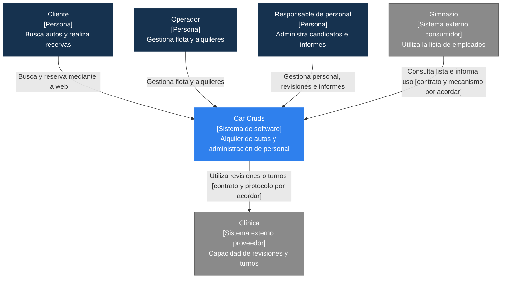
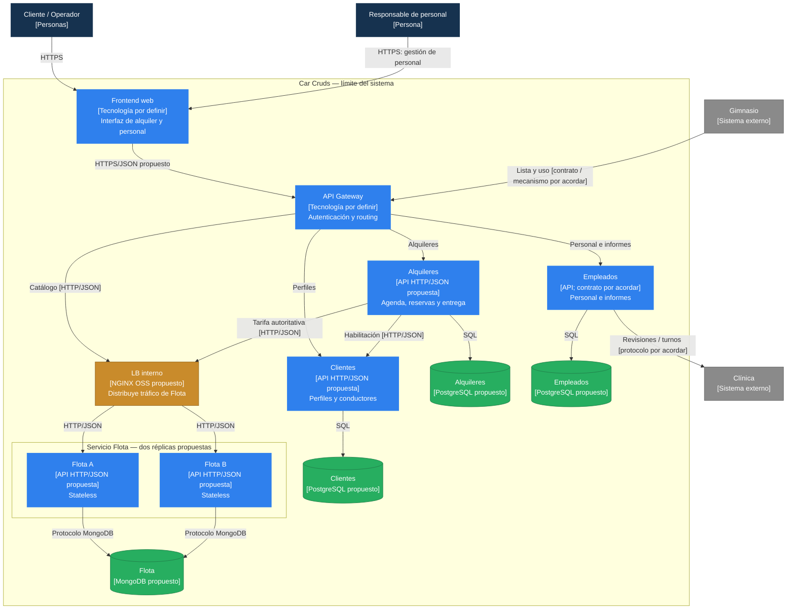
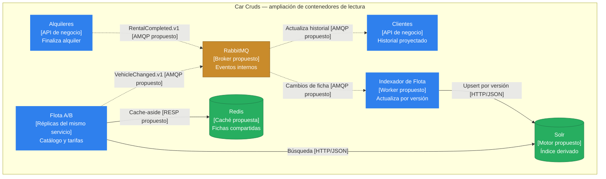
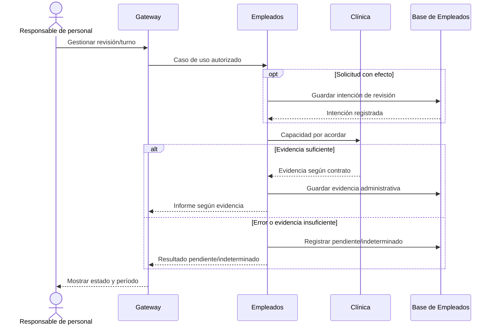

# Documento de arquitectura — Car Cruds

| Campo | Valor |
| --- | --- |
| Versión | 0.2 |
| Fecha | 10 de octubre de 2026 |
| Estado | Propuesto — no validado |
| Hito | Preparación documental de la Entrega 2 — 23 de octubre de 2026 |
| Decisiones relacionadas | D1/D3/D5 revisadas; D2, D6, D7, D9, D10, D12 y D13; primera versión de D11; D8 en documentación de contrato |

## 1. Propósito y estado del sistema

Car Cruds administra alquileres de autos por período y con tarifa. La confirmación de reserva conserva el precio acordado y evita asignaciones superpuestas; retiro y devolución controlan la ocupación física. El nuevo servicio Empleados administra candidatos y personal, ofrece una lista al Gimnasio y utiliza la capacidad de Clínica para revisiones o turnos e informes administrativos.

La versión 0.2 incorpora el feedback de la entrega 1: cuatro microservicios, integración externa ubicada en Empleados y balanceo interno de dos réplicas de Flota. Mantiene los límites de alquiler y el lenguaje de personal separados.

| Componente | Estado verificable al preparar este documento |
| --- | --- |
| Mock y contrato inicial de Alquileres | Artefactos locales de la entrega 1; simulación en memoria y un proceso |
| Cuatro microservicios, frontend y gateway | Responsabilidades y estructura documentadas; servicios reales pendientes |
| Empleados, integración clínica y lista para Gimnasio | Diseño y acuerdos de contrato pendientes; sin integración operativa |
| Persistencia, outbox, broker, índice y caché | Propuestas; sin implementación ni mediciones |
| NGINX y dos réplicas de Flota | Distribución propuesta; sin configuración ni ensayo |
| Logs, métricas, trazas, carga y despliegue | Plan documental; evidencia operativa pendiente |

Esta preparación documental no cumple por sí sola los requisitos operativos del 23 de octubre. La entrega 2 requiere un servicio real, almacenamiento integrado, funcionalidad compartida operativa y evidencia de logs correlacionados y primera traza.

## 2. Contexto del sistema — C4, nivel 1

**Figura 1. Contexto de Car Cruds — C4, nivel 1.** El Cliente utiliza el flujo de alquiler. El Operador administra flota y alquileres. El Responsable de personal administra candidatos, empleados e informes. Gimnasio y Clínica son los equipos externos identificados; sus contratos aún deben acordarse. Una persona registrada como empleado no adquiere por ello la habilitación de cliente conductor.

**Leyenda:** azul oscuro = persona; azul = sistema propio; gris = sistema externo. Las flechas indican quién inicia una interacción y su propósito; no fijan protocolos externos todavía inexistentes.

## 3. Contenedores — C4, nivel 2

Las figuras 2 y 3 presentan vistas complementarias del mismo sistema. La primera muestra acceso, servicios, réplicas y fuentes operativas; la segunda amplía mensajería y estructuras derivadas. Un contenedor técnico no se contabiliza como otro microservicio de negocio.

**Figura 2. Contenedores principales — C4, nivel 2.** Hay cuatro servicios de negocio: Clientes, Flota, Alquileres y Empleados. Flota A/B son réplicas del mismo servicio. Gateway y Alquileres acceden a Flota por el mismo LB interno. Empleados consume Clínica directamente; la llamada saliente no atraviesa frontend ni gateway propio.

La consulta de lista del Gimnasio entra por gateway y llega a Empleados. La flecha de uso representa una interacción todavía por acordar: si se adopta una recepción mediante nuestra API, tendrá el mismo borde controlado; si se elige otro mecanismo, se actualizarán contrato y vista. No presupone acceso externo a RabbitMQ.

**Leyenda:** azul oscuro = persona; gris = sistema externo; azul = aplicación o servicio; verde = almacenamiento; ocre = infraestructura. Flecha continua = solicitud o acceso a datos. Las tecnologías indicadas son propuestas; framework, versiones y contrato externo permanecen pendientes.

**Figura 3. Contenedores de soporte — complemento del C4 nivel 2.** Repite servicios para explicar sus lecturas derivadas. El indexador pertenece a Flota y no es un quinto servicio de negocio. Gimnasio y Clínica no se incluyen en el broker porque su mecanismo externo no se ha acordado.

**Leyenda:** azul = servicio o worker; verde = índice/caché; ocre = mensajería. Flecha continua = acceso síncrono; discontinua = evento interno. Publicadores de outbox e instrumentación no se representan como servicios adicionales.

### Propiedad de los datos

| Servicio | Responsabilidad | Datos propios |
| --- | --- | --- |
| Clientes | Perfil y habilitación del conductor; historial derivado | Cliente, licencia/estado, historial y mensajes procesados |
| Flota | Vehículo, características y tarifa vigente; catálogo y búsqueda | Ficha, tarifa, versión y cambios pendientes |
| Alquileres | Reserva exclusiva, precio acordado, agenda, retiro y devolución | Reservas, alquileres, bloqueos, idempotencia y outbox |
| Empleados | Candidatos y empleados; integración administrativa e informes | Personal, referencias externas, evidencia por período y origen, estado de integración |

Cada servicio usa su almacenamiento mediante sus propios permisos. Las bases PostgreSQL pueden compartir servidor de desarrollo, con bases y credenciales distintas. No hay consultas, JOIN ni claves foráneas sobre bases ajenas.

**Alquileres conserva la única autoridad sobre disponibilidad temporal.** Flota no duplica esa verdad con un booleano de disponibilidad. Una modificación administrativa de ficha no elimina reservas; las acciones que impidan una entrega requieren coordinación explícita con Alquileres.

Empleados conserva información administrativa mínima y referencias de turnos, sin diagnósticos ni inferencias de aptitud. Identidad externa de personal, campos concretos, permisos y retención se acordarán con los equipos. La evidencia debe permitir interpretar período, origen y vigencia; esto describe una necesidad interna, no un esquema externo aprobado.

## 4. Arquitectura interna y patrones

| Servicio | Estilo propuesto | Organización |
| --- | --- | --- |
| Alquileres | Hexagonal | Reglas y casos de uso; puertos para repositorio, Clientes, Flota y publicación; adaptadores externos |
| Empleados | Hexagonal | Casos de uso de personal e informes; puertos para repositorio y proveedor clínico; traducción del contrato en adaptadores |
| Clientes | Capas | Controlador HTTP → aplicación → repositorio |
| Flota | Capas | Controlador → aplicación → repositorios de ficha/búsqueda; adaptadores de índice y caché |

Hexagonal protege reglas y casos de uso de HTTP, drivers y tipos de Clínica. El adaptador implementa un puerto expresado en términos propios; las dependencias del código apuntan al núcleo. Capas mantiene responsabilidades simples de perfiles y catálogo. Ningún nombre de directorio demuestra por sí mismo estos estilos.

Repository, Adapter e inyección explícita de dependencias delimitan variaciones y permiten falsos en unitarios. Transactional Outbox e Idempotent Consumer protegen publicación y efectos derivados. Cache-aside optimiza lecturas de ficha; Circuit Breaker limita el impacto de dependencias lentas. Son patrones concretos justificados en los ADR, sin afirmar que estén implementados. Capas y Hexagonal son los estilos diferentes del requisito D2.

La Clínica pertenece al puerto de Empleados. Alquileres no conserva el puerto genérico de proveedor externo de la versión 0.1. No se propone Event Sourcing, un CQRS completo ni programación reactiva sin una necesidad demostrada.

## 5. Flujo de reserva y consistencia

1. Gateway autentica la entrada y dirige a Alquileres; el servicio autoriza el recurso.
2. Alquileres resuelve la idempotencia por aplicación, operación y clave antes de revalidar precio/agenda. Una carga distinta con la misma clave se rechaza.
3. Consulta habilitación a Clientes y ficha/tarifa autoritativas a Flota a través del LB. La lectura de confirmación omite la caché.
4. Compara el importe esperado con el cálculo autorizado.
5. En una transacción local registra exclusión del período, reserva, precio, respuesta idempotente y outbox.
6. Un publicador entrega el evento pendiente al broker. La caída temporal del broker conserva la reserva y la intención de publicación.

D4 aún debe determinar y probar la restricción de rangos o mecanismo de bloqueo concreto. Usar PostgreSQL no basta para afirmar que no existen carreras. No hay transacción global con Clientes o Flota. El precio aceptado se congela; cambios posteriores no modifican el acuerdo.

Retiro vuelve a validar conductor y ocupación física. Un alquiler activo impide otro retiro del mismo auto aunque haya vencido su fin previsto. Los cambios administrativos y las bajas con reservas futuras requieren coordinación por definir.

## 6. Flujo administrativo e integración externa

Empleados publica una lista de personal para Gimnasio y registra evidencia de uso/no uso por período y origen. El mecanismo de recepción, vinculación de personas, alcance de lista y criterios del informe deben acordarse. No se inventan tarifas, descuentos ni reglas económicas. Falta de evidencia no equivale a no uso confirmado.

La capacidad de Clínica interviene en el flujo de revisiones/turnos y en un informe con/sin turno confirmado. La información del proveedor se traduce al modelo administrativo; no se interpreta como diagnóstico, aptitud ni contratación automática.

**Figura 4. Secuencia administrativa propuesta.** No especifica endpoints, nombres de campos ni protocolo externo. Una solicitud con efecto se envía solo después de guardar su intención local de forma durable; una consulta no requiere ese paso. La respuesta válida habilita un informe sobre turnos; un timeout puede dejar resultado desconocido. Una operación con efecto no se reenvía automáticamente sin idempotencia o mecanismo de consulta acordado.

## 7. Mensajería, búsqueda y caché

Outbox guarda intención y cambio de negocio juntos; un relay puede duplicar. Historial de Clientes y registro de mensaje procesado se actualizan en la misma transacción antes del ACK. El indexador utiliza identificador estable y versión para evitar repetir o revertir efectos. Hay reintentos acotados, DLQ con responsable y reproceso controlado. La atomicidad de ficha/outbox en MongoDB debe resolverse antes de implementar.

Solr ofrecerá paginación, filtros y orden por tarifa. Los cambios actualizan el índice sin esperar una búsqueda del usuario. El retraso máximo de **5 segundos en operación normal** sigue siendo un objetivo propuesto, no medido. Reconstrucción y eliminación de fichas deben comprobarse.

Redis compartido utiliza **cache-aside**, TTL inicial propuesto de **60 segundos** e invalidación después de confirmar cambios en la fuente. Deben resolverse carreras de carga/invalidación. La confirmación de reserva siempre consulta la fuente de Flota sin caché. El impacto se medirá con la misma carga sin caché, fría y caliente.

## 8. Balanceo, resiliencia y observabilidad

NGINX interno distribuirá solicitudes de gateway y Alquileres entre dos réplicas stateless de Flota. Se propone round-robin inicialmente. La identidad y el permiso de la operación no dependen de qué réplica se elija. Las fuentes son compartidas; no se usan sesiones locales.

Se propone detección pasiva de fallas de réplica. Los chequeos activos periódicos de NGINX Plus no se atribuyen a OSS; la detección pasiva necesita tráfico y no demuestra readiness antes de recibir solicitudes. Los detalles verificados y la evidencia pendiente están en [D12](adr/ADR-012-balanceo-carga.md). Esta topología conserva un LB único y dependencias únicas; no demuestra alta disponibilidad completa.

Deadline, timeout, reintento limitado, Circuit Breaker y límites de concurrencia se definen por operación. La incertidumbre no se convierte en éxito ni en resultado negativo. Clínica caída afecta su flujo administrativo; no condiciona la reserva de autos. Redis caído puede derivar lectura a la fuente con capacidad acotada; Solr caído afecta búsqueda; broker caído retrasa proyecciones conservando outbox. [D10](adr/ADR-010-resiliencia.md) detalla las respuestas.

Los logs JSON, métricas y trazas incluirán correlación e instancia, sin tokens, diagnósticos ni documentos personales. El tablero permitirá observar distribución por réplica, errores/latencias, reintentos, circuitos, hit rate, retraso del índice, outbox/DLQ e integración administrativa pendiente. [D11](adr/ADR-011-observabilidad.md) define la primera propuesta de objetivos y alertas; todavía no hay evidencia operativa.

La demostración posterior comparará carga, caché y réplicas; provocará fallas y documentará recuperación en POSTMORTEM. [D13](adr/ADR-013-capacidad-costos.md) define medición y estimación de costos, sin resultados o importes inventados.

## 9. Distribución y decisiones pendientes

El frontend y gateway constituyen el acceso público. LB, servicios y almacenes permanecen internos. Cada servicio tendrá configuración por entorno y credenciales propias. Docker Compose sigue propuesto para el arranque local único; no se incorpora una configuración ejecutable en esta etapa documental.

| Aspecto | Trabajo pendiente |
| --- | --- |
| Contratos externos | Obtener/acordar listas, identidad, protocolo, estados, permisos, errores, idempotencia y entorno |
| Servicio operativo de entrega 2 | Implementar flujo y almacenamiento, sin confundir documentación con ejecución |
| Consistencia | D4, transacciones, concurrencia, outbox y recuperación de resultados desconocidos |
| Tecnologías | Framework/driver, versiones compatibles y operación de motores |
| Flota replicada | Configuración NGINX, direcciones, detección pasiva, tiempos y ensayo con evidencia |
| Evidencia técnica | Logs correlacionados, primera traza, medición de búsqueda/caché/carga y fallas |
| Publicación | URL accesible, credenciales de consumidores, configuración y permanencia del servicio |
| Capacidad y costos | Entorno, carga representativa, límite principal y precios oficiales fechados |

## 10. Referencias y continuidad de decisiones

Material de cátedra en `clases.zip`: teóricos 1 a 8; prácticas de Repository (2), caché (3), RabbitMQ (4), Solr (5) y NGINX (7). Los estilos y la diferencia gateway/LB se fundamentan respectivamente en los teóricos 8 y 6.

[D1 vigente](adr/ADR-014-limites-servicios-v2.md), [D2](adr/ADR-002-arquitectura-interna.md), [D3 vigente](adr/ADR-015-persistencia-v2.md) y [D5 vigente](adr/ADR-016-comunicacion-v2.md). Los ADR-001, ADR-003 y ADR-005 permanecen como registros reemplazados, conservando su cuerpo histórico. La capacidad compartida propuesta y su D8 se consultan en [contratos](contracts/README.md).

| Versión | Fecha | Cambio |
| --- | --- | --- |
| 0.1 | 7 de octubre de 2026 | Diseño inicial de tres servicios y capacidad de alquiler |
| 0.2 | 10 de octubre de 2026 | Añade Empleados, integración Gimnasio/Clínica y LB interno de Flota |
